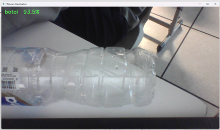
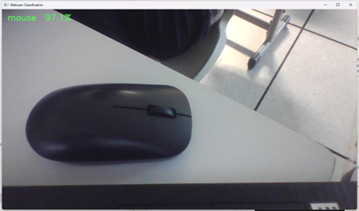
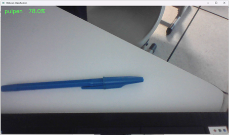

# Transfer Learning Image Classifier (PyTorch)

Pipeline end-to-end untuk klasifikasi gambar: split dataset 70/15/15, augmentasi, transfer learning (MobileNetV2 / ResNet50 / EfficientNet-B0), evaluasi lengkap, tes robustnes, dan demo webcam.

## Fitur Utama
- Otomatis memecah dataset mentah per kelas ke `data/train`, `data/val`, `data/test`
- Augmentasi kuat + normalisasi ImageNet, loader menyesuaikan CPU/GPU
- Training dua tahap: freeze backbone lalu fine-tune sebagian layer atas
- Metrik uji + confusion matrix + laporan JSON tersimpan di `artifacts/`
- Tes robustnes (blur, noise, occlusion) dan demo webcam real-time

## Prasyarat
- Python 3.9+ dan pip
- PyTorch + torchvision (ikuti perintah resmi sesuai GPU/CPU: https://pytorch.org/get-started/locally/)
- Paket lain: `opencv-python`, `scikit-learn`, `matplotlib`, `pillow`, `numpy`

Contoh instalasi cepat (CPU):
```bash
python -m venv .venv
.\.venv\Scripts\activate
pip install torch torchvision --index-url https://download.pytorch.org/whl/cpu
pip install opencv-python scikit-learn matplotlib pillow numpy
```

## Struktur Data
```
raw_dataset/
  kelas_a/*.jpg
  kelas_b/*.jpg

setelah split ->
data/
  train/kelas_a/...
  val/kelas_a/...
  test/kelas_a/...
```

## Cara Jalan Cepat
1) (Opsional) Split dataset mentah
```bash
python mainprogram.py --raw raw_dataset --data data
```

2) Latih + evaluasi
```bash
python mainprogram.py --data data --model mobilenetv2 --ep1 8 --ep2 8 --batch 32
```
Model lain: `resnet50`, `efficientnetb0`.

3) Lihat keluaran di `artifacts/`:
- `model_best.pt`, `classes.txt`
- `confusion_matrix.png`, `report.json`
- `robustness.json`, `robustness.png`

4) Demo webcam (setelah artefak ada)
```bash
python mainprogram.py --webcam --model mobilenetv2 --cam-index 0
```

5) Demo saja tanpa training (pastikan artefak sudah ada)
```bash
python mainprogram.py --webcam-only --model mobilenetv2 --cam-index 0
```

## Cara Kerja Singkat
- Augmentasi: random resized crop, flip, rotasi, color jitter, blur; validasi/tes pakai resize+center crop.
- Tahap 1: backbone dibekukan, hanya classifier dilatih (lr1).
- Tahap 2: sebagian layer atas dibuka, fine-tune dengan lr2 + weight decay.
- Evaluasi: laporan classification report & confusion matrix; robustness test pada blur/noise/occlusion.
- Demo: memuat `classes.txt` + `model_best.pt`, menghitung EMA probabilitas untuk stabilisasi teks overlay.

## Tips
- Pastikan setiap kelas punya cukup gambar sebelum split.
- Gunakan GPU jika tersedia; script otomatis memilih `cuda` jika ada.
- Coba kurangi `--batch` jika memori terbatas; ubah `--cam-index` sesuai kamera yang dipakai.
  
## **Hasil**




